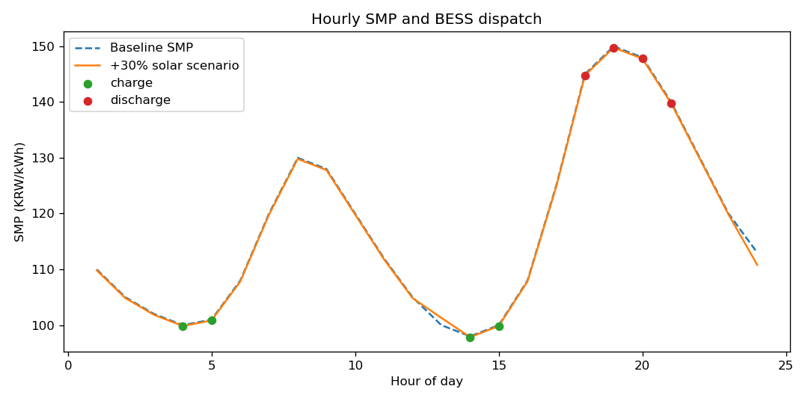
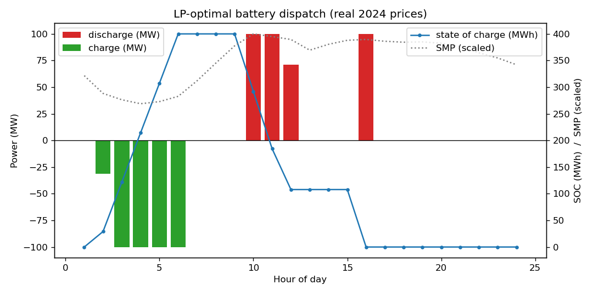

# Yeongnam 100MW BESS — Arbitrage NPV

**Turning a causal estimate into an investment decision.** My working paper
estimates how solar generation moves Korea's System Marginal Price (SMP). This
project asks the business question that follows: **is a 100MW / 4h battery in the
Yeongnam region worth building on price arbitrage alone?**

Built entirely on the paper's own 2024 data — the same 140,138-observation panel
behind the regression — not stylized inputs.

## Two findings that survive the real data

**1. Korea has no "duck curve" yet — so the battery charges pre-dawn, not midday.**
The cheapest hours in 2024 are 03–05h (~96 KRW/kWh), when solar output is zero;
midday and evening sit on a broad expensive plateau (~134–142). The solar-driven
midday price dip that BESS arbitrage relies on in California has not emerged in
Korea's single-price market.

**2. More solar slightly *raises* the spread here — the opposite of the naive story.**
My paper's hourly estimates show a positive solar effect on *daytime* SMP (the
"intraday absorption pattern"). Because the battery discharges into those
daytime-peak hours, growing solar nudges its revenue *up*, not down. But the
effect is second-order.



## TL;DR result

| Metric | Value |
|---|---|
| System | 100 MW / 4 h (400 MWh) |
| Baseline SMP (real 2024) | mean 125.5 KRW/kWh, min h4 = 96, max h10 = 142 |
| Dispatch | charge 03–06h (~98), discharge daytime peak (~141) |
| Arbitrage spread | ~42 KRW/kWh |
| Daily net revenue | ~$7,800 |
| Capex | ~$140M (~$350/kWh) |
| **NPV @ 7%** | **≈ −$142.5M** |
| IRR | undefined (cash flows never recover capex) |

*Reported in USD at ~1,350 KRW/USD (2024 avg); the analysis itself is KRW-native.*

**Energy arbitrage alone does not justify the capex** — a robust, defensible
finding. The contribution is quantifying *how far* it misses and *which levers*
would close it.

## Break-even levers (what would make NPV = 0)

| Lever | Required | vs. now |
|---|---|---|
| Capex | ~$47/kWh | ~7x below market (~$348) |
| Daily arbitrage | ~7.4x larger | spread far beyond the data |
| Stacked revenue | ~$156/kW-yr | capacity / ancillary on top |

## Robustness: the econometric debate is immaterial to the investment

My paper flags that the hourly solar sign is contested (the daytime effect is
positive, against intuition). The model quantifies how much that matters:

| Elasticity scenario | NPV |
|---|---|
| as-estimated (national HTE) | −$142.5M |
| solar-hours only (night = 0) | −$142.7M |
| Yeongnam intensity (×2.3)    | −$141.1M |
| flat IV average (−0.0058)    | −$143.4M |

All within ~2%. **The contested sign matters for the paper, not for the business
call** — capex dominates. Even at ~$110/kWh (below market) NPV is still −$30M.

## Phase 4 — LP-optimal dispatch

`run_phase4.py` replaces the heuristic with a linear program that maximizes daily
arbitrage subject to real battery physics (power limit, energy capacity,
state-of-charge balance with round-trip efficiency, daily cycle cap).



The LP optimum is **~8% below** the heuristic — because the heuristic implicitly
buys a full cycle's charging energy in 4 hours, which violates the power limit.
The LP charges over ~5 pre-dawn hours and stops discharging once the marginal
charge hour costs more than the discharge. It is the physically feasible optimum
(NPV −$144.3M vs the heuristic's −$142.5M — both deeply negative), so the
conclusion is intact.

## How it works

```
real 2024 SMP + hourly IV elasticities  ->  price scenario  ->  daily arbitrage
   ->  cash flows (capex, O&M, degradation)  ->  NPV / IRR  ->  break-even
```

The bridge from academics to business is one equation:

```
scenario_SMP[h] = baseline_SMP[h] * (1 + solar_growth) ** elasticity[h]
```

| Module | Responsibility |
|---|---|
| `scripts/build_inputs_from_panel.py` | Derive real hourly inputs from the research panel |
| `src/assumptions.py`    | All inputs in one place, units in the key names |
| `src/price_scenario.py` | Reshape baseline SMP via hourly elasticities |
| `src/arbitrage.py`      | Pick charge/discharge hours, daily net revenue |
| `src/cashflow.py`       | Capex, O&M, degradation -> annual cash flows |
| `src/valuation.py`      | NPV, IRR, payback |
| `src/breakeven.py`      | Closed-form break-even capex / arbitrage / stacking |
| `src/optimize_dispatch.py` | LP: optimal charge/discharge under battery physics |
| `run_phase3.py`         | Orchestrate: summary, break-even, robustness, plots |
| `run_phase4.py`         | LP dispatch optimization vs the heuristic |

## Run

```bash
pip install -r requirements.txt
python3 run_phase3.py                       # NPV, break-even, robustness, sensitivities
python3 run_phase4.py                       # LP-optimal dispatch vs the heuristic
```

To regenerate the inputs from the raw research files:

```bash
python3 scripts/build_inputs_from_panel.py \
    --panel ".../panel_v4_main.csv" --hte ".../v4_phase2_hte.csv"
```

## Data

| Input | Source |
|---|---|
| `data/baseline_smp_hourly.csv` | National hour-of-day mean SMP, 2024 mainland panel (N=140,138) |
| `data/solar_profile_hourly.csv` | National hour-of-day mean solar generation, same panel |
| `data/elasticities.csv` | Hourly log(SMP)~log(Solar) IV coefficients (Phase 2 HTE) |

Only these small aggregates live here; the raw panel stays in the research repo.
The one literature-based input is battery capex (~$350/kWh, NREL ATB 2024 /
Lazard LCOS midpoint) in `assumptions.py` — and the break-even table shows the
conclusion holds across the full $300–400/kWh range.

## Limitations

*Market structure*
- Korea has a **single national SMP**, so this is **temporal** (intraday)
  arbitrage, not locational — Yeongnam is the asset's location and the solar
  driver, not a separate regional price.
- The **single-buyer (CBP) market** means the model assumes **SMP price-taker
  access**. Standalone merchant arbitrage is regulatorily limited in Korea, where
  ESS revenue in practice stacks REC / frequency-regulation / peak-shaving. This
  is therefore an *upper-bound screen* of temporal arbitrage — which makes the
  negative result conservative.

*Modeling*
- Perfect-foresight dispatch (heuristic and LP); no price-forecast error.
- One representative day (hour-of-day mean SMP); day-to-day volatility that can
  widen spreads is averaged out, likely *understating* arbitrage value.
- Energy arbitrage only — no capacity payment, frequency regulation, or REC
  revenue (exactly the stacking the conclusion says is required).
- Flat 2%/yr degradation and O&M as a share of capex; no augmentation capex.

*Data / inputs*
- The positive daytime elasticity is the paper's own contested result; night-hour
  coefficients are weakly identified (solar ≈ 0) and zeroed in the conservative
  run. NPV stays within ~2% across all scenarios.
- The IV elasticity is a marginal estimate; extrapolating to +30–100% solar is
  out-of-sample.
- Capex is literature-based (NREL ATB 2024 / Lazard, ~$350/kWh); break-even holds
  across $300–400/kWh.

## Context

Business extension of the working paper *"Does Solar Generation Lower the Korean
SMP?"* (IV / 2SLS, 2024 hourly panel, 16 mainland regions, first-stage F = 27,351;
national effect −0.58%, Yeongnam −1.35%). This repo is the "academic result →
business case" layer.
