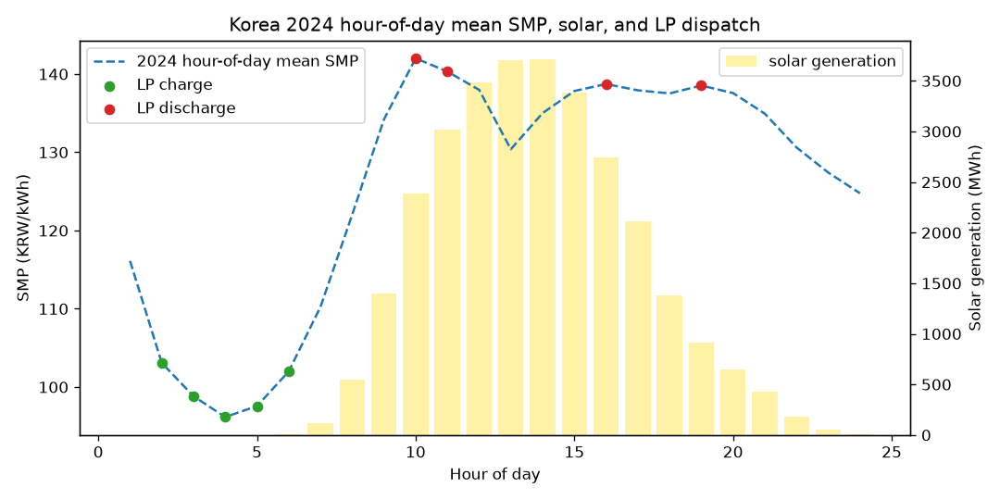
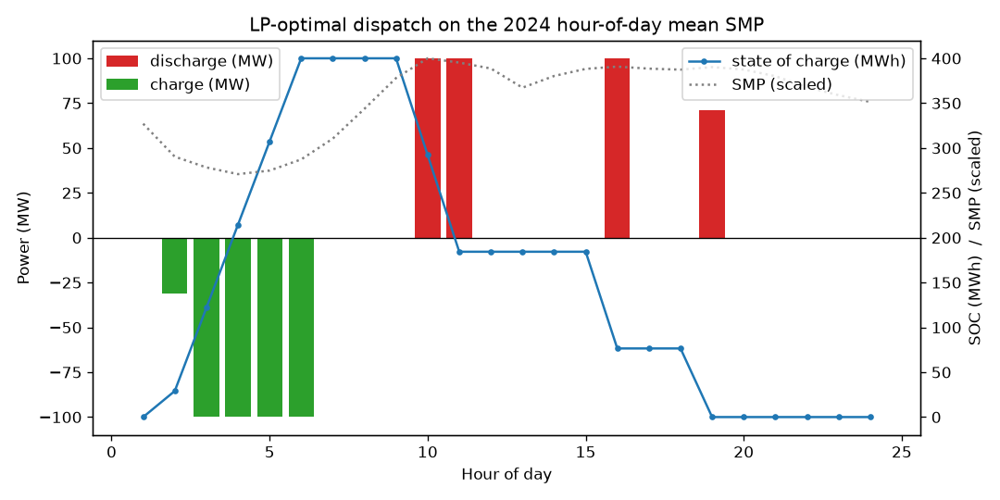
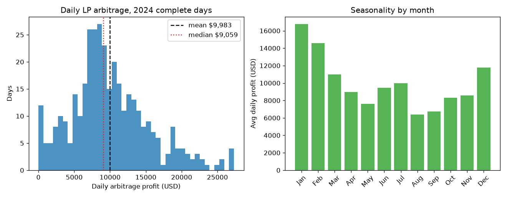
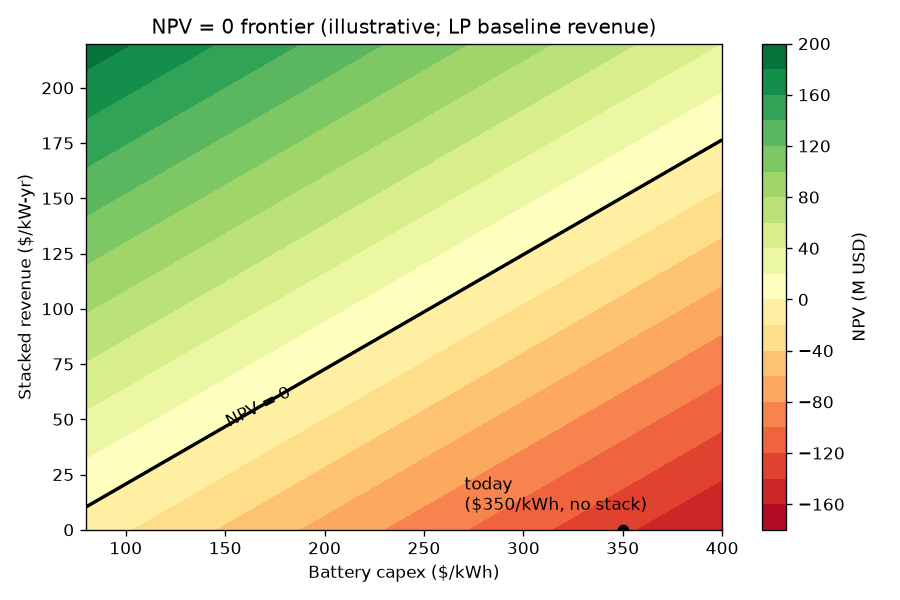
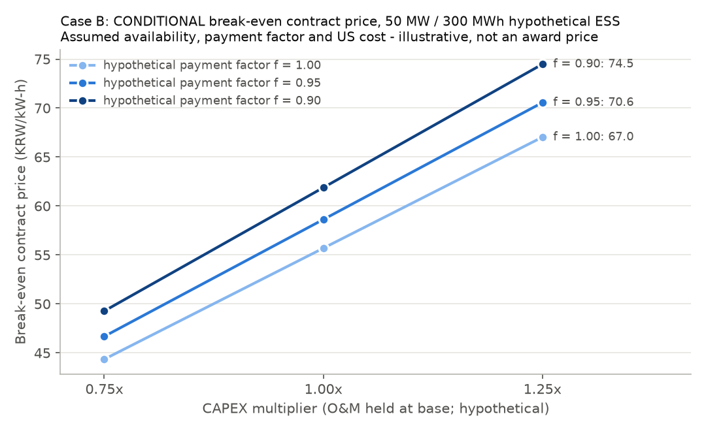

# Korean BESS screening model — 2024 SMP arbitrage (A) and a conditional central-contract scenario (B)

The repository name (`yeongnam-bess-npv`) is kept for continuity. The analysis
itself uses the **single national SMP** and does **not** model Yeongnam-specific
prices, grid constraints or sites.

## Questions, methods and limits

| | Case A — SMP arbitrage | Case B — central contract financial scenario |
|---|---|---|
| Question | Under observed 2024 SMP and stated cost, operating and finance assumptions, does a 100 MW / 4 h battery recover its capex from price-taker arbitrage alone? | Under the settlement structure of KPX notice 제2026-05호 (2026 mainland ESS central contract market), what fixed contract price would give NPV = 0 for a hypothetical 50 MW / 300 MWh (송전단, 6 h) plant, given stated cost and payment assumptions? |
| Method | Per-day LP dispatch on the **364 complete days** of 2024 hourly SMP (a diagnostic sample, not a full calendar year); perfect foresight within each day; SOC empty at midnight; 1 internal cycle/day; mean day × 350 operating days; 15-year cash flows at 7% | Annual cash flows from the notice's settlement structure and the operation rules' hourly EFR form; cost from the ATB 2024 v3 6-hour OCC (US 2022$) at an assumed exchange rate; break-even price solved and re-substituted |
| Result | NPV ≈ −$136.2M under these assumptions | Break-even ≈ 55.69 KRW/kW-h ⚠ **conditional** |
| Main limits | One historical year repeated; perfect foresight; revenue haircut for degradation; 24 missing hours unexplained; discount-rate basis not reconciled with the price basis (see Limitations) | Conditional on the cost basis (US 2022$ OCC, no Korean connection/financing cost), the payment assumption (contracted EOSE, hypothetical factor f) and the capacity-maintenance method (contract conformity unconfirmed). Not an actual biddable project and not an assessment of Korean BESS profitability in general |

A and B differ in size, duration, period, revenue mechanism and cost basis all
at once. The gap between them is **not a causal effect of policy**, and B does
not show that the central contract market is profitable.

## Observed 2024 hourly price pattern (description, not a causal finding)

In the hour-of-day mean SMP used here (`data/baseline_smp_hourly.csv`), the
lowest hours are 03–05h (96.2–98.8 KRW/kWh). Hours 09–21h lie between 130.4 and
142.0. The hour convention (hour-ending KST) is assumed, not verified. The LP
therefore charges mainly in the early morning.

This is an observation about 2024 prices. **Why** prices have this shape (demand,
fuel costs, must-run generation, solar output or other factors) is not tested in
this repository. The data do not show a midday price trough in 2024. That is
not evidence about how prices will respond to future solar growth.



## Case A result (baseline, `run_baseline.py`)

| Metric | Value |
|---|---|
| System | 100 MW / 4 h — 400 MWh **internal** usable storage (a full cycle draws 431 MWh, delivers 371 MWh at 86% RTE) |
| Prices | Observed 2024 national SMP, **364 complete days** (2024-01-02 … 2024-12-30); 2 incomplete dates excluded, not filled |
| Dispatch | LP per day (power, SOC, efficiency, 1 cycle/day, SOC empty at midnight, perfect foresight) |
| Mean daily arbitrage profit* | $9,983 (7 no-trade days; 0 loss days) |
| Analysis-period profit sum* | $3.63M over the 364 complete days (not a full calendar year) |
| Annualised year-1 profit* | $3.49M (daily mean × 350 assumed operating days) |
| Year-1 O&M | $2.79M |
| Capex | $139.3M (470,000 KRW/kWh ≈ $348/kWh) |
| **NPV @ 7%** | **≈ −$136.2M** |
| IRR | undefined (cash flows never recover capex) |

\*Arbitrage profit = discharge revenue − charging cost at SMP, before fixed O&M.
*KRW-native model; USD at a fixed reporting rate of 1,350 KRW/USD. 2024 prices
are repeated for 15 years: a what-if on one historical year, not a price forecast.*

The previously published −$142.5M came from an infeasible heuristic on the
hour-of-day mean day under the +30% solar scenario; the audit reproduces it and
explains every step of the change ([docs/model_audit.md](docs/model_audit.md),
`outputs/before_after_comparison.csv`).

Under these assumptions (2024 prices repeated, perfect foresight within the day,
the stated capex, O&M, degradation and 7% rate), price-taker arbitrage alone does
not recover the capex. The break-even levers below show how far it misses.

## Break-even levers (what would make NPV = 0)

Each value is plugged back into the cash-flow model and returns |NPV| < 1 KRW
(`outputs/breakeven_check.csv`).

| Lever | Required | vs. now |
|---|---|---|
| Capex | ~$60/kWh | ~5.8x below the $348 assumption |
| Daily arbitrage | ~5.8x larger | spread far beyond the 2024 data |
| Stacked revenue | ~$150/kW-yr | constant extra revenue on top (illustrative; no market price assumed) |

## LP dispatch vs the original heuristic

The original heuristic charges the 4 cheapest and discharges the 4 dearest hours.
It ignores hour order, books 400 MWh delivered from 465 MWh drawn in 4 h (116 MW
against a 100 MW limit), and always trades. The LP (`src/optimize_dispatch.py`)
enforces power, SOC bounds, the SOC balance with √RTE per leg, empty start/end
SOC, and one internal cycle per day; it may choose not to trade. Solver status is
checked, and every schedule is re-checked independently (`check_dispatch`).



On the hour-of-day mean day, the LP earns **8.3% less** than the heuristic
($6,851 vs $7,468/day) because it respects the power limit and delivers 371 MWh
rather than 400 MWh. It is the feasible optimum.

## Full-year distribution & break-even map

`run_analytics.py` uses the same per-day LP as the baseline.

**Average day vs every day.** The LP on each of the 364 complete days averages
**$9,983/day**, vs $6,851 on the hour-of-day mean curve (+46%). This gap is
expected by construction (optimizing on averaged prices cannot beat the average
of per-day optima), so the representative day is only a diagnostic. Daily profit
is volatile and seasonal: P10 $3.3k, P90 $17.7k, 7 no-trade days, no loss days;
January averages $16.8k/day vs August $6.4k/day.



**What would bring NPV to zero?** The map sweeps battery capex against a
constant extra revenue stream ($/kW-yr, illustrative; no market price is
assumed) and draws the NPV = 0 frontier. The assumed point ($350/kWh, no extra
revenue) sits deep in the red.



## Case B — 2026 mainland ESS central contract market (hypothetical 50 MW / 300 MWh)

Case A asks whether SMP arbitrage alone recovers capex. Case B asks a different
question: under the contract rules of KPX notice 제2026-05호 (2026-09-22), what
**fixed contract price** would give NPV = 0? B is a separate case. Its facts are
taken from the notice PDF (not stored in the repository; download locations in
[docs/source_manifest.md](docs/source_manifest.md)), with page references in
[docs/market_rules.md](docs/market_rules.md).

- Bids must be > 10 MW and < 100 MW, sized at the 송전단 for 6 hours. The price is in KRW/kW-h of 공급가능용량 and is fixed for the 15-year trading period.
- Charging cost and discharge revenue are **not settled**, so B contains **no SMP arbitrage**.
- Daily settlement = Σ_{t=1..24} price × (max stored energy ÷ 6) × performance rate.
- The cost input is the **6-hour** ATB 2024 v3 workbook overnight capital cost for the 2023 column: 2,680.80 $/kW (cell H111) = 446.80 $/kWh in **2022$**, converted at an assumed 1,350 KRW/USD. It excludes ATB's $100/kW grid-connection cost and construction financing. It is an educational scenario, not a Korean quote. Fixed O&M = 0.025 × that cost (ATB formula) and includes battery augmentation, so capacity is held constant and no separate degradation haircut is applied. Whether that way of holding capacity (adding capacity to make up degradation) conforms to the notice, which quotes a restriction on adding design capacity "보증수명의 연장목적으로", is **unconfirmed** ([docs/market_rules.md](docs/market_rules.md) §6b). The earlier 4-hour input (476.74 $/kWh, p* 59.4203) is kept as a reproduction case.
- **B is a conditional annual financial model, not a reproduction of the actual settlement.** The annual model (`breakeven_contract_price`) does **not** call the hourly settlement function (`hourly_performance_rate`). The notice-form function raises an error for hours with no dispatch instruction, because the notice does not define that case. The operation rules (2026. 7., 별표2 Ⅰ.18) do define it, and `hourly_efr_rules` / `hourly_settlement_rules_krw` implement it. With the contracted EOSE and EFR = 1 in every hour, the rules' payment equals the annual model at f = 1, so p* is unchanged.

| CAPEX multiplier (one-variable, O&M held fixed) \ hypothetical payment factor f | 1.00 | 0.95 | 0.90 |
|---|---|---|---|
| 0.75 | 44.3 | 46.7 | 49.3 |
| **1.00** | **55.7 ⚠** | 58.6 | 61.9 |
| 1.25 | 67.0 | 70.6 | 74.5 |

*Break-even contract price, KRW/kW-h. ⚠ **Conditional result**: the settlement
rule is confirmed from the operation rules, but the annual model assumes the
contracted EOSE and a constant hypothetical factor f in all 8,760 hours. There is
no dispatch or metering data, the cost is a US 2022$ reference, and the contract conformity of the capacity-maintenance method is unconfirmed. The multipliers and factors are hypothetical,
not an official range or operating data. No award price is known, so this says
nothing about actual profitability or bid success.* The derivation, the
simplifications and the blocked items are in
[docs/contract_model_design.md](docs/contract_model_design.md). The 4-page
review memo is [docs/technical_memo.md](docs/technical_memo.md); a 1-page note is [docs/explainer_note.md](docs/explainer_note.md).



## Exploratory: solar-coefficient scenario (not part of the baseline)

This section depends on hourly coefficients from a separate working paper. Their
estimation code, units and sample are **not in this repository** and have not
been verified here (see [docs/model_audit.md](docs/model_audit.md), D1–D4). The
hourly vector's mean (+0.004) also disagrees in sign with the stated average
(−0.0058). The results are exploratory only. They are not evidence that more solar
raises or lowers the arbitrage spread.

`run_phase3.py` reshapes the **hour-of-day mean** price curve with the hourly
coefficient vector at +30% solar *generation* and re-runs the LP on that one
average day. The coefficients are treated as log-log elasticities
(`scenario = base × exp(β·ln 1.3)`); their estimation code is not in this repo.

| Coefficient vector (exploratory) | NPV (representative day) |
|---|---|
| no scenario (observed mean day)          | −$145.1M |
| as-estimated (national HTE)              | −$144.3M |
| solar-hours only (night = 0)             | −$144.5M |
| national HTE rescaled ×2.3               | −$143.0M |
| flat IV average (−0.0058)                | −$145.1M |

Across these coefficient vectors the representative-day NPV moves by ~1.5%. The ×2.3 row rescales the *national* vector and still
applies it to the *national* SMP, so it is **not** a Yeongnam causal effect or a
regional price. The representative day is itself below the per-day baseline
(−$145.1M vs −$136.2M) because averaging prices first can only lower the
optimum.

## How it works

Baseline:

```
data/smp_2024_hourly.csv -> completeness checks (keep 364 complete days, no filling)
  -> LP dispatch per day -> mean daily net x 350 operating days
  -> cash flows (capex, O&M, degradation) -> NPV -> break-even (re-substituted)
```

Exploratory scenario (representative day only):

```
scenario_SMP[h] = mean_SMP[h] * (1 + solar_generation_growth) ** elasticity[h]
```

| Module | Responsibility |
|---|---|
| `scripts/build_inputs_from_panel.py` | Derive real hourly inputs from the research panel |
| `src/assumptions.py`    | All inputs in one place, units in the key names |
| `src/price_scenario.py` | Reshape baseline SMP via hourly elasticities |
| `src/data_checks.py`    | Coverage report (dates, hours per date, duplicates, zero prices); keep complete days |
| `src/arbitrage.py`      | Legacy heuristic (comparison only; infeasible) |
| `src/cashflow.py`       | Capex, O&M, degradation -> annual cash flows |
| `src/valuation.py`      | NPV, IRR, payback |
| `src/breakeven.py`      | Closed-form break-even capex / arbitrage / stacking |
| `src/optimize_dispatch.py` | LP dispatch + independent constraint check |
| `src/daily_arbitrage.py` | Per-day LP over complete days (baseline engine) |
| `run_baseline.py`       | **Headline**: data checks, per-day LP, NPV, break-even check, before/after CSVs |
| `run_analytics.py`      | Daily distribution, seasonality, NPV = 0 frontier |
| `run_phase4.py`         | Representative day: heuristic vs LP |
| `run_phase3.py`         | Representative-day diagnostic + exploratory solar scenarios |
| `tests/test_model.py`   | Case A: hand calculation, no-trade, constraint, solver-status, break-even and data tests |
| `src/contract_case.py`  | Case B: notice settlement formula, cash flows, break-even contract price |
| `run_contract_case.py`  | Case B: p*, CAPEX x performance-rate grid, cash-flow table, figure |
| `tests/test_contract.py` | Case B: settlement hand calculations, units, bid range, re-substitution |

## Run

```bash
pip install -r requirements.txt
./run_all.sh                                # everything below, in order
python3 -m pytest -q                        # 30 tests (A: 14, B: 16)
python3 run_baseline.py                     # headline + outputs/*.csv
python3 run_audit.py                        # cap / engine / NPV-bridge audit tables
python3 run_analytics.py                    # distribution + break-even map
python3 run_phase4.py                       # heuristic vs LP (representative day)
python3 run_phase3.py                       # representative day + exploratory scenarios
python3 run_contract_case.py                # case B: break-even contract price
```

To regenerate the inputs from the raw research files:

```bash
python3 scripts/build_inputs_from_panel.py \
    --panel ".../panel_v4_main.csv" --hte ".../v4_phase2_hte.csv"
```

## Data

| Input | Source |
|---|---|
| `data/baseline_smp_hourly.csv` | National hour-of-day mean SMP, 2024 mainland panel (N=140,138) |
| `data/solar_profile_hourly.csv` | National hour-of-day mean solar generation, same panel |
| `data/elasticities.csv` | Hourly log(SMP)~log(Solar) IV coefficients (Phase 2 HTE) |
| `data/smp_2024_hourly.csv` | National hourly SMP, 2024, from the same panel (8,760 rows over 366 dates: 364 complete days; 2024-01-01 lacks hour 24 and 2024-12-31 has only hour 24; 6 hours at 0 KRW/kWh) |

Only these small aggregates live here; the raw panel stays in the research repo.
Hour 1–24 is assumed hour-ending KST (hour 24 = 23:00–24:00); this and the
missing-hour cause are unverified without the raw file (`outputs/data_validation.csv`).
The one literature-based input is battery capex (~$350/kWh, NREL ATB 2024 /
Lazard LCOS midpoint) in `assumptions.py` — and the break-even table shows the
conclusion holds across the full $300–400/kWh range.

## Limitations

See [docs/model_audit.md](docs/model_audit.md) for evidence and open items.

*Market structure*
- Korea has a **single national SMP**, so this is **temporal** (intraday)
  arbitrage, not locational. No regional price, grid constraint or site is
  modelled.
- The **single-buyer (CBP) market** means the model assumes **SMP price-taker
  access**. Standalone merchant arbitrage is regulatorily limited in Korea, where
  ESS revenue in practice can come from other sources (REC, frequency regulation,
  peak shaving, contracts). None of these is modelled.
- Perfect foresight makes the LP profit an **upper bound on arbitrage profit only
  for the same prices and the same operating constraints** (power, SOC window,
  efficiency, 1 cycle/day, SOC empty at midnight). It is **not** an upper bound on
  an actual project's total revenue: other revenue streams, or different
  operating rules (e.g. continuous SOC, more cycles), can yield more.

*Dispatch*
- **Perfect foresight** within each day (overstates achievable revenue; no
  forecast-error model).
- **SOC reset to empty at every midnight.** One LP over all 364 days with
  continuous SOC and the same per-day cycle cap earns +0.65%; also pooling the
  cycle cap over the year gives +3.1% (`outputs/audit_engine_comparison.csv`).
- 1 internal cycle/day cap (a modelling choice made in the audit; the pre-audit
  code capped delivered energy, which allowed 1.08 internal cycles — effect −0.44%); charge/discharge at the meter with √RTE per leg; no
  auxiliary load, no minimum SOC, no ramp limits. Simultaneous charge/discharge
  is checked and does not occur (prices are ≥ 0; negative prices would need a
  binary mode constraint).

*Finance*
- One historical year repeated for 15 years: a what-if, not a forecast.
- Annual revenue = mean daily LP profit × 350 operating days; the 364-day
  actual-period sum is $3.63M vs $3.49M.
- 2%/yr degradation applied as a revenue haircut, not tied to cycling; no
  augmentation/replacement capex, residual value or tax. With flat O&M, net cash
  flow turns negative in years 13–15 and there is no early-retirement option.
- The 7% discount rate is not labelled real or nominal, and the price basis is
  not reconciled with it. 2024 prices (2024 KRW) and O&M are held flat for 15
  years. A consistent pair would be a real rate with constant-2024-KRW flows, or a
  nominal rate with escalated prices and costs. This check is open; the inputs
  are unchanged.
- Energy arbitrage only — no capacity payment, frequency regulation, or REC
  revenue.

*Data / inputs*
- 24 hours of 2024 are missing from the series; 2 dates are excluded, never
  filled or shifted.
- Solar coefficients: the regression specification, units, sample and code are
  not in this repo, and the hourly vector's mean (+0.004) disagrees in sign with
  the stated average (−0.0058). Solar results are therefore exploratory only.
  Applying a marginal estimate to a +30% change is out-of-sample.
- Capex is literature-based (NREL ATB 2024 / Lazard, ~$350/kWh; exact table not
  verified here); break-even capex is ~$60/kWh.

## Context

The 2024 hourly inputs come from the data panel of a separate working paper,
*"Does Solar Generation Lower the Korean SMP?"* (IV / 2SLS, 2024 hourly panel, 16
mainland regions). That paper's coefficients (reported −0.0058 national and
−0.0135 Yeongnam; read as log-log elasticities, −0.0058% and −0.0135% SMP per +1%
solar) enter **only** the exploratory scenario above. Their estimation is not
reproduced or verified in this repository.
